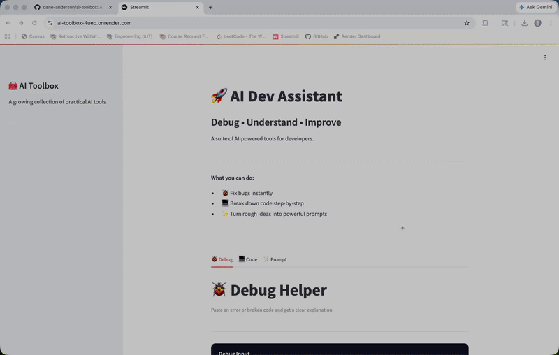

# 🧰 AI Toolbox

AI tools that help you **debug faster, understand code, and build better**.

---

## 🚀 Live App

<b>Try it live </b>

  

 

## 🎬 Demo

---
## 🧠 What It Does

AI Toolbox is a Streamlit app powered by OpenAI that helps developers:

- 🐞 Debug code instantly  
- 🧠 Break down complex logic step-by-step  
- ✨ Turn rough ideas into strong AI prompts  

---

## ⚙️ Built With

- Python + Streamlit  
- OpenAI API  
- Render (deployment)  
---

## 🧠 Overview

AI Toolbox is a Streamlit-based web app that leverages the OpenAI API to help developers:

- Debug code faster  
- Understand unfamiliar code  
- Improve prompts for better AI outputs  

This project demonstrates full-stack AI integration, from local development to cloud deployment on Render.

---

## ✨ Features

### 🐞 Debug Helper
- Paste broken code and error messages  
- Get clear explanations and suggested fixes  

### 💻 Code Explainer
- Breaks down code step-by-step  
- Helps understand logic and structure  

### ✨ Prompt Improver
- Transforms rough prompts into high-quality AI prompts  
- Optimized for better results with LLMs  

---

## 🛠 Tech Stack

- **Python**
- **Streamlit**
- **OpenAI API**
- **Render (Cloud Deployment)**
- **Git + GitHub**

---

## 🚀 Deployment

This app is fully deployed on Render and accessible here:

👉 https://ai-toolbox-4uep.onrender.com

Key deployment features:
- Environment variables for API security  
- Automated builds via GitHub integration  
- Live cloud hosting  

---
## 🌐 Deployment & Integration

This application was fully developed and deployed end-to-end, including:

- Local development using Streamlit  
- Integration with the OpenAI API for real-time AI responses  
- Deployment to Render for live cloud hosting  
- Secure management of environment variables for API keys  
- Debugging and resolving real-world deployment issues (dependency management, runtime environments)

This project demonstrates the ability to take an idea from development to a fully live, production-ready application.
---
## 🛠️ Setup & Usage

To run this project locally, follow these steps:

### 1. Set your OpenAI API key (required)

export OPENAI_API_KEY=your_key_here

### 2. Clone and start the app

git clone https://github.com/dane-anderson/ai-toolbox.git  
cd ai-toolbox  
pip install -r requirements.txt  
streamlit run app.py  

---

## 🚀 Future Development

This project is designed to evolve beyond a simple demo into a powerful developer tool. Potential next steps include:

### 🧰 Daily-Use Dev Tool
- Save and reuse prompts, code snippets, and debugging sessions  
- Build a personal AI-powered development workspace  

### 🌐 Browser Extension
- Integrate directly into sites like GitHub  
- Highlight code and instantly explain or debug it  

### 👥 Team Tool
- Add user accounts and shared workspaces  
- Enable teams to collaborate with AI-powered tools  

### 💰 SaaS Product
- Introduce subscriptions and usage tiers  
- Turn the app into a scalable, production-ready service  

---

## 💡 Vision

This project represents more than a single app — it is the foundation for a full AI-powered developer productivity platform.

The goal is to transform everyday development workflows using AI, making debugging, learning, and prompt engineering faster and more intuitive.
